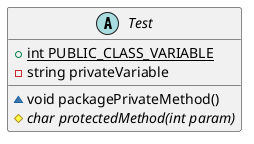

# PlantUML

```plantuml
@startuml Пример

abstract class Test {
    +{static} int PUBLIC_CLASS_VARIABLE
    -string privateVariable
    ~void packagePrivateMethod()
    #{abstract} char protectedMethod(int param)
}

@enduml
```
